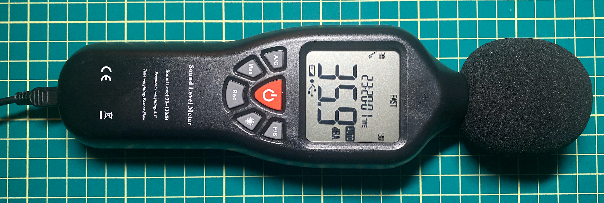

# WL100 Sound Pressure Level meter

Python code to collect values from a WL100 (a.k.a "SLM-25", "Silicon Labs WL100", "SLAB WL100") Sound Pressure Level meter.



## Install

```
pipenv install
```

If you're a [nix](https://nixos.org/download.html) user, there's a simple python-ready `shell.nix` available.

I'll put this in PyPi if there's interest.

## Run

```
pipenv run wl100
```

…or if you're not a pipenv user, just:

```
python wl100.py
```

(You'll need to `pip install hidapi` or `pip3 install hidapi` first.)

`wl100.py` (and the Pipenv script) takes an integer parameter if you want it to only run for some number of seconds.

The library should be pretty easy to figure out from the ifmain block.


## Example

(with some amount of slapping the windscreen)

```
❯ pipenv run wl100 5
36.9dBA
(1sec=35.1, 5sec=None, 15sec=None, 30sec=None)
(1min=None, 5min=None, 15min=None, 30min=None)
87 values
Elapsed: 1s

45.5dBA
(1sec=40.03, 5sec=None, 15sec=None, 30sec=None)
(1min=None, 5min=None, 15min=None, 30min=None)
172 values
Elapsed: 2s

94.9dBA
(1sec=81.71, 5sec=None, 15sec=None, 30sec=None)
(1min=None, 5min=None, 15min=None, 30min=None)
254 values
Elapsed: 3s

94.0dBA
(1sec=93.66, 5sec=None, 15sec=None, 30sec=None)
(1min=None, 5min=None, 15min=None, 30min=None)
335 values
Elapsed: 4s

78.4dBA
(1sec=89.56, 5sec=None, 15sec=None, 30sec=None)
(1min=None, 5min=None, 15min=None, 30min=None)
412 values
Elapsed: 5s
```
